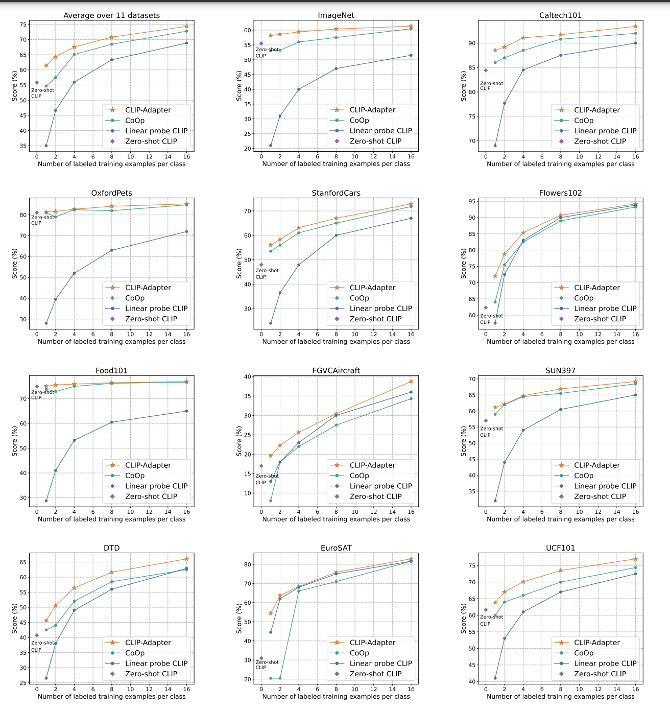

# Official Code Release for "CLIP-Adapter: Better Vision-Language Models with Feature Adapters"

# Pipeline of CLIP-Adapter
CLIP-Adapter is a drop-in module designed for CLIP model on few-shot classfication tasks. CLIP-Adapter can improve the few-shot classfication of CLIP with very simple design.

  

# Results of CLIP-Adapter compared with baseline
Comparison with CLIP, Linear-probe CLIP, CoOp on eleven few shot classfication tasks. 

  

# New version of CLIP-Adpter
Please check [Training-free CLIP-Adapter](https://github.com/gaopengcuhk/Tip-Adapter).

# Contributor
Shijie Geng, Renrui Zhang, Peng Gao

# Acknowledegement
CLIP and CoOp
