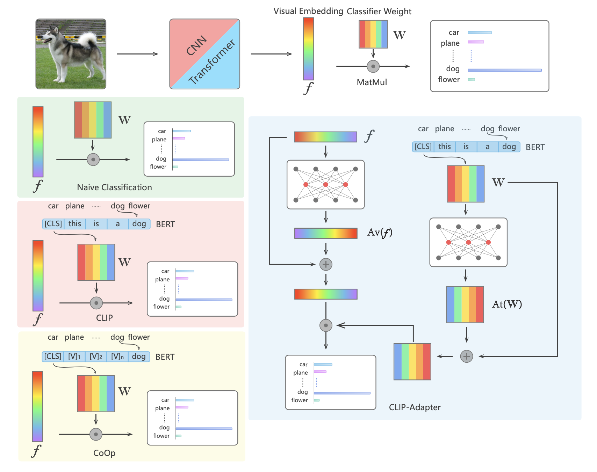

# CLIP-Adapter: Better Vision-Language Models with Feature Adapters
Official implementation of ['CLIP-Adapter: Better Vision-Language Models with Feature Adapters'](https://arxiv.org/pdf/2110.04544.pdf).

## Introduction
CLIP-Adapter is a drop-in module designed for CLIP on few-shot classfication tasks. CLIP-Adapter can improve the few-shot classfication of CLIP with very simple design.
<div align="center">
  
</div>

## Requirements
We utilize the code base of [CoOp](https://github.com/KaiyangZhou/Dassl.pytorch). Please follow their instructions to prepare the environment and datasets.

## Get Started
Put `clip_adapter.py` under `./trainers` and add the related `import` codes. Then follow CoOp's command to run for ImageNet.

The complete codes will be released soon.


## New version of CLIP-Adapter
Please check [Tip-Adapter: Training-free CLIP-Adapter](https://github.com/gaopengcuhk/Tip-Adapter).

## Contributors
[Renrui Zhang](https://github.com/ZrrSkywalker), Peng Gao

## Acknowledegement
This repo benefits from [CLIP](https://github.com/openai/CLIP) and [CoOp](https://github.com/KaiyangZhou/Dassl.pytorch). Thanks for their wonderful works.

## Citation
```bash
@article{gao2021clip,
  title={CLIP-Adapter: Better Vision-Language Models with Feature Adapters},
  author={Gao, Peng and Geng, Shijie and Zhang, Renrui and Ma, Teli and Fang, Rongyao and Zhang, Yongfeng and Li, Hongsheng and Qiao, Yu},
  journal={arXiv preprint arXiv:2110.04544},
  year={2021}
}
```

## Contact
If you have any question about this project, please feel free to contact zhangrenrui@pjlab.org.cn and gaopeng@pjlab.org.cn.
